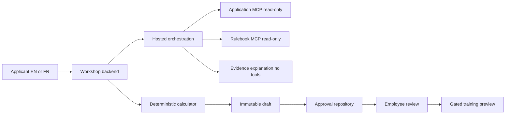
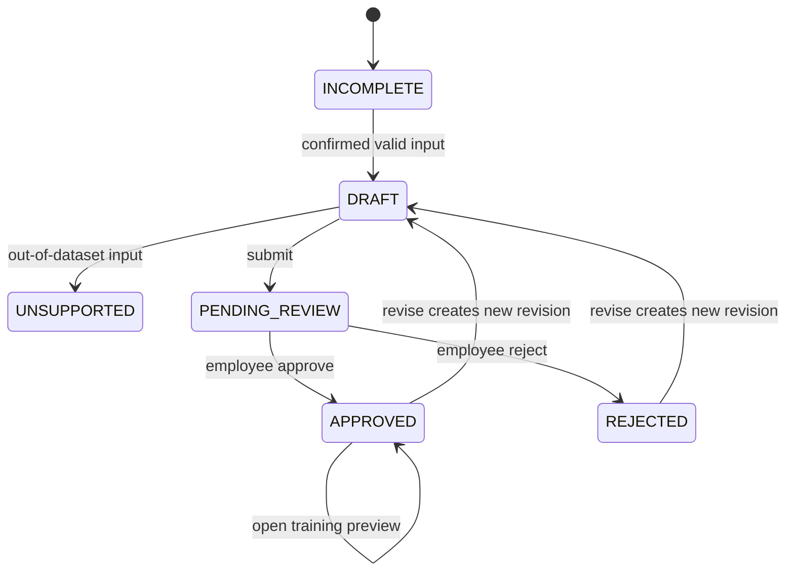

<!-- markdownlint-disable-file -->
# Task Research: Desjardins Bilingual Hosted Agents Workshop

Research status: Complete on 2026-09-13. Adversarially reviewed on 2026-09-13; see Risk Register. This is the authoritative synthesis of the supporting research. No application implementation, deployment, or workshop execution occurred. No risk in the Risk Register remains rated Critical or High after mitigation; open items are Medium or Low and tracked as gates, not defects.

## Task Implementation Requests

* Research a bilingual English/French workshop for Desjardins using Microsoft Foundry hosted agents, informed by the supplied coach-preparation PDF.
* Adapt the teaching structure of the sibling Air Canada workshop while selecting a different financial-services use case.
* Research only. Do not scaffold, deploy, authenticate, install dependencies, or modify files outside .copilot-tracking/research/.

## Scope and Success Criteria

* Scope: Customer PDF, sibling curriculum and implementation, current official Foundry documentation, scenario alternatives, bilingual behavior, architecture, and implementation gates.
* Assumptions: This is a reusable workshop informed by a historical brief, not a submission to the original competition. EN/FR delivery comes from the user request; en-CA and fr-CA are proposed locales.
* Success criteria: Page-cited customer requirements, verified reuse map, one selected scenario and architecture, alternatives, complete illustrative contracts, and actionable implementation gates. Research criteria are met; runtime readiness is not established.
* Exclusions: Real applicant data, real pricing/underwriting, quote issuance/delivery, customer-system access, deployments, and production/compliance certification.

## Outline

1. Evidence and customer requirements.
2. Selected scenario and architecture.
3. Nine-lab EN/FR adaptation and alternatives.
4. Examples, implementation sequence, and verification gates.

## Selected Recommendation

Build a bilingual workshop around synthetic Ontario auto-insurance quote preparation with employee approval before a simulated applicant-facing preview. This directly matches the challenge on PDF pages 8-9. Preserve Air Canada's nine-lab progression, paired documentation, shared bilingual deck model, role-limited tools, tracing, and evaluations. Replace airline data/prompts and add a deterministic synthetic calculator plus application-owned employee approval.

The LLM assists intake and explanation. It never sets prices, approves its own work, issues insurance, or sends a quote. All offers are invented training examples, nonbinding, and explicitly not actual Desjardins products or Ontario rating rules.

## Potential Next Research

Six follow-up areas remain as implementation gates, not blockers to the scenario recommendation. Each is labeled for cross-reference from the Risk Register.

1. (Gate G1) Organizer policy and delivery: New-event context, duration, audience, bilingual review, Copilot restriction, submission channels, and independent human confirmation of the decisive PDF facts on pp. 8-9 and 12-13 (PDF pp. 3-5, 12-13).
2. (Gate G2) Approved platform/security: Terms, model/SKU, region, quota/cost, concurrency capacity for up to 75 participants, networking, tool authentication, reviewer identity, and telemetry handling (official sources below).
3. (Gate G3) Reproducible compatibility: Required Azure AI guidance, sibling source freeze, exact SDK/protocol/client versions, Toolbox transport, live-check naming, and any framework migration decision (sibling report).
4. (Gate G4) Domain and approval review: Synthetic terminology/rules, reviewer experience, persistence/concurrency, actor-authorization implementation evidence, and no-delivery boundary (PDF p. 9; platform report).
5. (Gate G5) Bilingual pilot: Runtime equivalence, localization/rendering, accessibility, realistic timing, and release evidence (PDF p. 12; sibling parity findings).
6. (Gate G6) Regulatory and privacy sign-off: Legal, Privacy, AMF, and FSRA-aware review before any real data, real jurisdiction claim, or public release is considered; not started, and out of scope for this research.

## Research Executed

### File Analysis

| Source | Verified finding and limit |
| --- | --- |
| README.md:1 | Target initially contains only its title; no workshop implementation. |
| assets/Hackathon - Rencontre prep des coachs.pdf, pp. 2-4, 16 | Agentic-AI experimentation and talent development; up to 75 employees in 15 multidisciplinary teams. Not proof of uniform developer proficiency. |
| Same PDF, pp. 8-9 | Ontario auto-insurance quotation with employee approval before sending. No actuarial rules or implementation supplied. |
| Same PDF, pp. 10-13 | Event services, judging, deliverables, Copilot prohibition, and timing. No hosted-agent entitlement or deployment established. |
| ../foundry-hosted-agents/docs/index.md:45-79; docs/labs/ and docs/fr/labs/ in that sibling | Nine paired labs for engineers/architects/SREs. Detailed lab times total 305 minutes versus the index's 290; pilot and correct the agenda. |
| ../foundry-hosted-agents/src/threat-assessment-agent/graph.py:519-564; toolbox.py:18-80 | Fixed sequential orchestration, allowlisted retrieval, tool-free summarization. Not independently deployed or parallel autonomous specialists. |
| ../foundry-hosted-agents/src/threat-assessment-agent/runtime_evidence.py:30-37; tests/test_runtime_evidence.py:27-103 | Application rejects native conversation identifiers and explicit store:true. Approved clients send store:false and carry history. Tests inspected, not executed. |
| ../foundry-hosted-agents/eval/golden-dataset.jsonl:1-8; eval/deterministic-tests/checks.py:72-196 | Useful failure categories; English runtime fixtures and substring checks do not prove bilingual behavior or valid citations. |
| ../foundry-hosted-agents/infra/modules/ai-foundry.bicep:48-64, 145-165; infra/modules/mcp-container-apps.bicep:33-51, 95-124 | Public synthetic infrastructure and unauthenticated tool connections are not an FSI production baseline. |

Sibling findings concern a changing working tree at observed HEAD 2e10a60e168bd6707d0f5dae380d6d595430b077. Concurrent uncommitted edits affected several labs. Freeze the selected source before import; inspected content is not necessarily committed or published.

Supporting reports:

* .copilot-tracking/research/subagents/2026-09-13/workshop-context-research.md: Initial inventory and authoring rules; pending findings there are historical and superseded here.
* .copilot-tracking/research/subagents/2026-09-13/desjardins-customer-evidence-research.md: All 16 PDF pages, evidence boundaries, scenario ranking, and organizer questions.
* .copilot-tracking/research/subagents/2026-09-13/air-canada-workshop-research.md: Lab/source anchors, bilingual parity, dependency drift, reuse map, and proposed focused commands.
* .copilot-tracking/research/subagents/2026-09-13/platform-and-scenario-decision-research.md: Eight official sources, complete JSON fixture/schema, approval transactions, 21 acceptance examples, and eight implementation gates.

### Code Search Results

* Directory inventory found .git/, assets/, and README.md at target root; no application source, dependency manifest, or test configuration was visible.
* Explicit existence checks found no AGENTS.md or .github/copilot-instructions.md at the target root or any ancestor through the drive root.
* Initial workspace search found no existing .copilot-tracking/research/ files.

### External Research

Researcher Subagent retrieved these official Microsoft Learn pages with fetch_webpage on 2026-09-13. The platform report records the complete eight-source register and page update dates. These are documented capabilities, not observed tenant availability.

* [Hosted agents](https://learn.microsoft.com/en-us/azure/foundry/agents/concepts/hosted-agents): Dedicated protocols, versions, sessions, regions, and identities.
* [Runtime components](https://learn.microsoft.com/en-us/azure/foundry/agents/concepts/runtime-components): Native history and nonpersistent requests.
* [Hosted runtime contract](https://learn.microsoft.com/en-us/azure/foundry/agents/concepts/hosted-agent-contract): Routes, readiness, identity headers, and streaming.
* [Hosted deployment](https://learn.microsoft.com/en-us/azure/foundry/agents/how-to/deploy-hosted-agent): Container requirements and gateway routing.
* [Private networking](https://learn.microsoft.com/en-us/azure/foundry/agents/how-to/virtual-networks): Creation-time constraints and conflicting path-specific private-ingress wording.
* [Durable state store](https://learn.microsoft.com/en-us/azure/foundry/agents/concepts/agent-state-store): Explicit public preview, ETags, and caller-based isolation; not a proven cross-user approval store.

Delegates lacked tool_search and could not invoke required deferred Azure AI guidance. Public documentation was retrieved, but that tooling requirement remains incomplete. No cloud operations, authentication, or model calls occurred.

### Project Conventions

* The supplied HVE Markdown and writing-style instructions were read, as was the installed Task Researcher template.
* Tracking research begins with the required markdownlint-disable-file comment and follows the Task Researcher headings. The Markdown guide excludes files carrying that comment; do not place YAML before it.
* Use plain workspace-relative paths in tracking artifacts, including ../foundry-hosted-agents/ for sibling references. Do not turn local paths into links or #file directives. External URLs may use Markdown links.
* Use concise, evidence-grounded prose, descriptive headings, ASCII punctuation, language-tagged code fences when needed, and a final newline. Avoid em dashes, inflated claims, and bold-prefix bullets.
* Later non-exempt workshop Markdown requires frontmatter. A title in frontmatter replaces an H1; use H2 for the first content heading. English/French text may require real accented characters.
* Use apply_patch for manual edits. Keep all generated research artifacts under .copilot-tracking/research/.

## Key Discoveries

### Project Structure

The target is a minimal repository with a 16-page customer PDF. The sibling has nine paired Jekyll labs, deck generators, LangGraph agent, two MCP services, Bicep, evaluation tooling, and optional web/persistence surfaces. Reuse selectively; do not copy all historical evidence and infrastructure.

### Customer and Historical Constraints

The brief describes May 19-20, 2026 and a June 8 final, both past. Reuse its requirements, not its dates as a future schedule or as proof of event outcomes. The document is French; bilingual delivery comes from the user request.

Page 12 judges agent relevance, human control, domain data/rules, robustness, observability, responsible AI, business value, feasibility, and pitch quality. Measure synthetic preparation steps, latency, evidence completeness, and blocked unauthorized previews. Do not claim actual sales improvement or regulatory compliance.

GitHub Copilot is prohibited during the competition (p. 12), with assistance attribution required. Provide a Copilot-free learner path and confirm policy for a later workshop. This is not a prohibition on GitHub source control or Actions. Original submissions use DevOps for code/README and SharePoint for slides, one-pager, and video (pp. 12-13); GitHub alone would not meet those event rules.

Technical judging is 30 minutes on pp. 3-4 but 25 on p. 13. Coaching references also differ between 10 and 15 minutes. Do not resolve these by assumption. A reusable 25-minute demo envelope fits either judging slot, but is a new recommendation.

The PDF names "LIDIA" as the hackathon's Azure lab environment and an unexpanded acronym "PDM" for the technology capabilities Desjardins wants adopted (pp. 3, 16). Neither is confirmed available, current, or equivalent to a standard Foundry hosted-agent environment. Do not assume this workshop can deploy into LIDIA, and do not expand PDM without an authoritative source; treat both as customer-internal labels requiring confirmation, not as accessible infrastructure.

### Regulatory and Privacy Boundary

The PDF does not name any regulator, privacy law, or compliance framework. This is an evidence gap, not a signal that none applies. Desjardins is a Quebec-based financial cooperative and insurer previously subject to a large-scale member-data breach (2019) that led to heightened regulatory and public scrutiny of its data practices; any Desjardins-branded AI exercise carries elevated sensitivity even when synthetic. Ontario auto insurance is regulated by FSRA; Desjardins as a Quebec financial institution is also subject to the AMF (Autorite des marches financiers) and Quebec's Law 25 (Act respecting the protection of personal information in the private sector), plus PIPEDA federally. None of these bodies is referenced in the source PDF and none has reviewed or approved this workshop design.

Treat every generated notice, rulebook, and calculator output as an explicit non-product, nonbinding training simulation with no FSRA, AMF, or other regulatory endorsement, no actuarial validity, and no claim of Desjardins product equivalence. Do not introduce real member data, real policy numbers, or any field resembling a real Quebec or Ontario government identifier at any point, including in synthetic fixtures. A production adaptation of this exercise requires a separate Legal, Privacy, and AMF/FSRA-aware review before any real data or real release path is considered; that review is out of scope for this research and is tracked as gate G6 (Regulatory and privacy sign-off) in the Risk Register.

### Platform Findings

* Retain explicit store:false plus application-carried history for the first adaptation, subject to version-specific testing. Current Foundry supports native history; the sibling restriction is application-specific. Neither history mode proves employee approval or zero retention.
* Responses gateway: {project_endpoint}/agents/{name}/endpoint/protocols/openai/responses. Container routes: /responses and /readiness, default port 8088. These differ from MCP transport routes/ports.
* Verify one exact adapter/protocol/client combination before publishing commands. Official snippets and sibling packages differ; no version lock or deployment command is certified here.
* Canadian regions are listed, but model/SKU, quota, permission, terms, and processing residency remain unverified. GlobalStandard does not become Canadian-only processing because the resource is Canadian.
* Do not label all hosted agents GA or preview from historical slides. Retrieved sources have feature-specific preview notices; intended deployment terms/SLA require confirmation.
* Creation-time network constraints and inconsistent private-ingress wording require an approved topology check. Do not promise private ingress or weaken registry/tool security to make a demo work.
* The PDF's own audience figure is up to 75 employees across 15 teams (pp. 2-3). If this curriculum is ever delivered live at that scale, up to 15 concurrent hosted deployments (or more, per-learner) would compete for the same regional quota, model TPM, and budget observed in the sibling's staging-versus-default capacity split. Do not silently assume 75 individual learner deployments; prefer team-scoped shared sandboxes with an explicit pre-approved quota and cost ceiling, confirmed before scheduling a live cohort.

### Implementation Patterns

Select one hosted LangGraph orchestrator containing logical intake/reference specialists and a tool-free composer. A separate small workshop backend owns confirmed inputs, deterministic calculation, immutable drafts, employee approval, and applicant/reviewer views. Keep the framework to avoid an unnecessary migration; the architecture and state-machine diagrams are in Technical Scenarios below.

Expose only get_application(fixtureId) and get_rulebook(rulebookId). No arbitrary SQL, URLs, paths, write tools, approval tools, or insurer integrations. Read-only annotations alone are not enforcement: use strict schemas, immutable fixtures, fixed allowlists, and authorization.

The pure calculator uses invented tables and integer CAD cents. Missing/unsupported/unavailable evidence yields no amount and a specific issue. The model cannot infer rates, discounts, taxes, coverage, eligibility, or real insurance rules.

ApprovalRepository is initially SQLite-backed in a single-instance workshop backend on retained teaching storage. Persist immutable revisions, record versions, actor context, transitions, and receipts transactionally. The overall application has writes; only its MCP services are read-only. This demonstrates controls, not HA, tamper-proof audit, regulatory retention, or production security.

Do not store shared approval in an applicant's hosted session or infer it from model text. A local reviewer simulation must be server-controlled and clearly labeled; shared remote use requires authenticated reviewers, case authorization, and protected review endpoints.

Bind approval to the exact draft and active rules. Check actor/ownership, expected record version, state, and revision atomically. Identical command replays return the original receipt; changed payloads conflict. Concurrent approve/reject commands permit one winner. Store outages or uncertain commits block preview until recovered. Restart with retained storage must preserve state.

Applicant output uses bounded intake/status templates, never raw employee-facing composer output. Amount-bearing drafts stay with the reviewer until approval. Approved previews use authoritative fields and reviewed localized templates. No email, webhook, SENT state, issuance, or binding action exists. Locale-only changes preserve state; business-content changes require renewed approval.

### Complete Examples

This self-contained calculator fixture is illustrative test data, not an implemented API or real rate table. The calculator must not read expected output to compute its answer.

```json
{
	"dataClass": "SYNTHETIC_ONLY",
	"fixtureId": "CASE-SYN-001",
	"input": {
		"locale": "fr-CA",
		"jurisdiction": "ON",
		"vehicleClass": "COMPACT",
		"plan": "TRAINING_EXTENDED"
	},
	"rulebook": {
		"id": "RULEBOOK-SYN-ON",
		"version": "training-1",
		"authority": "WORKSHOP_AUTHORS_ONLY",
		"baseCents": { "COMPACT": 80000, "SEDAN": 90000 },
		"planAddOnCents": { "TRAINING_BASIC": 0, "TRAINING_EXTENDED": 20000 }
	},
	"expected": {
		"amountCents": 100000,
		"currency": "CAD",
		"period": "TRAINING_YEAR",
		"state": "PENDING_REVIEW",
		"approvedRevision": null,
		"applicantPreviewAllowed": false
	}
}
```

The platform supporting report's Illustrative JSON Contract section contains the full strict draft-07 schema, fixture, trusted actor boundary, and 21 acceptance examples. JSON/schema and negative mutations passed; no application implementation exists. Structural schema validation does not prove arithmetic, authority, or state correctness.

### API and Schema Documentation

Separate confirmed structured input from free-text conversation. Keep canonical IDs, enums, cents, revisions, and issue codes equal across EN/FR. Tool content is untrusted evidence. Reject extra command fields, including client-supplied actor/role overrides. Trace tool receipts and transitions, not hidden chain of thought. Follow the official protocol references above only after validating the exact toolchain.

### Configuration Examples

Proposed organization, not created implementation files:

```text
README.md
docs/index.md
docs/labs/ (nine labs)
docs/fr/index.md
docs/fr/labs/ (matching filenames)
docs/assets/decks/ (EN and FR outputs)
src/quote-preparation-agent/
mcp/application-server/
mcp/rulebook-server/
apps/workshop/ (calculator, approval repository, applicant/reviewer views)
data/synthetic/
eval/ (paired language cases and deterministic controls)
infra/ (approved isolated sandbox)
scripts/ (validated helpers and shared bilingual deck source)
```

No tenant/subscription identifiers, credentials, endpoints, model deployment names, or package versions are prescribed before approved discovery and compatibility checks.

## Technical Scenarios

### Bilingual Workshop Adaptation

Requirements: English/French learner materials and runtime behavior, synthetic-only Ontario quotation scenario, hosted execution, and separately enforced employee approval.





Preferred approach: Canonical nine-lab curriculum plus a shorter facilitated route through the same assets. Retain objectives, numbered exercises, expected outputs, knowledge checks, and reciprocal language navigation. Publish natural reviewed French with accents, stable executable identifiers, and localized speaker notes. Structural parity alone is not semantic or runtime parity.

| Lab | Topic | Desjardins exercise |
| --- | --- | --- |
| 00 | Setup and fixtures | Validate synthetic boundaries, calculator oracle, language choice, policy, and approved access. |
| 01 | Architecture | Trace who can read, calculate, persist, and approve. |
| 02 | MCP tools | Two read-only services; direct transport versus hosted Toolbox access; failure cases. |
| 03 | Hosted deployment | Approved isolated sandbox and one verified protocol/toolchain. |
| 04 | Invocation and review | EN/FR intake, correction, approval/rejection, revision invalidation, and gated preview. |
| 05 | Evaluations | Arithmetic, evidence, approval, injection, missing data, isolation, and language parity. |
| 06 | CI/CD | Evidence gates and protected promotion; distinguish CI approval from business approval. |
| 07 | Troubleshooting and RBAC | Auth/network/evidence/storage failures, concurrent commands, and positive telemetry. |
| 08 | Readiness and demo | Happy/blocked paths; README, one-pager, slides, and demo with evidence limits. |

Short route: preverified setup, core concepts from labs 01-05, then lab 08; labs 06-07 become follow-on or instructor-led. A 150-180 minute core is an estimate after prework, not tested timing or completion of all nine labs. Full delivery needs a technical day or split sessions, subject to piloting and participant experience.

### Selective Reuse

| Retain conceptually | Rewrite or verify | Exclude or defer |
| --- | --- | --- |
| Nine-lab arc and paired EN/FR site | Domain data, prompts, terminology, golden cases | Airline branding, support tickets, historical run evidence |
| Tool isolation and tool-free composer | Calculator and durable business approval | Autonomous pricing, underwriting, real sending |
| SSE completion and deterministic/judge split | Exact references, arithmetic/state tests, EN/FR cases | English-only parser assumptions |
| Shared deck model and evidence-status legend | Localized notes and new synthetic screenshots | Old decks represented as Desjardins evidence |
| Isolated deployment and positive telemetry | Version pins, learner-name-compatible checks, approved security | Public unauthenticated infrastructure as FSI baseline |
| Minimal graph architecture | Freeze sibling source before selective import | Whole-repo copy and optional Cosmos/Agent 365 complexity |

#### Considered Alternatives

| Alternative | Advantages | Reason not selected |
| --- | --- | --- |
| Claims intake and adjuster packet | Bounded insurance evidence workflow | Insurance adjacency only; no direct challenge evidence (PDF pp. 8-9). |
| Card-dispute evidence packet | General FSI timeline/evidence exercise | More domain setup and weaker customer fit. |
| Rename airline workshop | Low apparent authoring effort | No customer-specific quote workflow or persisted employee gate; carries stale assumptions. |
| Short workshop only | Accessible mixed-role learning | Omits deployment-to-readiness depth; retain as a route through canonical nine-lab assets. |
| Model-written/conversation-only approval | Little persistence code | Cannot prove employee authority, revision binding, concurrency, or restart recovery. |
| Foundry state store as initial approval database | Documented persistence/ETags | Explicit preview and caller isolation require cross-user validation; defer as optional adapter. |
| Migrate now to Microsoft Agent Framework or another hosted-agent SDK | Newer unified Foundry-native option; may reduce long-term platform drift | Adds an unverified migration on top of an already-unverified toolchain (Platform Findings); sibling reuse and current research evidence are LangGraph-based. Revisit only after the G3 compatibility gate and, when available, required Azure AI best-practices tool guidance. |

## Actionable Implementation Sequence

1. Confirm synthetic scenario, audience, format, EN/FR expectations, and applicability of historical competition rules.
2. Freeze selected sibling source; obtain required Azure AI guidance and validate one exact SDK/CLI/protocol/model combination before publishing commands.
3. Implement an offline vertical slice: strict fixtures, pure calculator, immutable drafts, transactional approval, and bounded applicant/reviewer output. Test allowed and forbidden paths first.
4. Add read-only MCP services and hosted orchestration in an approved sandbox. Verify authorization, complete SSE output, history/corrections/isolation, and correlated telemetry.
5. Adapt nine EN/FR labs and shared deck source from the tested slice, including paired runtime cases rather than prose translation alone.
6. Pilot delivery, execute release gates, render localized assets, and record new evidence. Advanced CI/CD or real integrations require separately approved scope.

## Risk Register

Adversarial review pass, 2026-09-13. Severity scale: Critical > High > Medium > Low. This register lists every material risk found while stress-testing the recommendation, with its initial severity and the mitigation already designed into the recommendation above. After mitigation, no risk remains rated Critical or High; Medium items are explicit, non-blocking implementation gates, and Low items are considered adequately addressed for a research artifact.

| ID | Risk | Initial severity | Mitigation already designed | Residual severity |
| --- | --- | --- | --- | --- |
| RR1 | Single-source PDF misreading of a decisive fact (for example jurisdiction, approval requirement) | High | Two independent extraction passes (encoding-corrected pdftotext plus full reread), page-cited quotations for every critical fact, explicit human bilingual sign-off required on pp. 8-9 and 12-13 before any learner-facing publication | Low, pending the human sign-off gate G1 |
| RR2 | Workshop output implies real regulatory or actuarial authority (FSRA, AMF) or a real Desjardins product | Critical | Mandatory bilingual nonbinding/training-only notice in the rulebook and every surface, explicit no-FSRA/no-AMF-endorsement statement, forbidden-authority refusal test V20 | Low |
| RR3 | Privacy or data-protection exposure given Quebec Law 25, PIPEDA, and Desjardins' breach history | Critical | Synthetic-only data class enforced by schema, explicit ban on real member data or real-looking identifiers, mandatory Legal/Privacy/AMF review gate before any real-data path is considered (G6) | Low |
| RR4 | Model self-approval or a spoofed reviewer identity releases an unapproved quote | Critical | Server-authored actor context only, no trusted client actor/role fields, explicit tests V09 and V11 | Low, pending implementation evidence (G4) |
| RR5 | Cost or quota exhaustion from concurrent hosted deployments if scaled to the PDF's 75 participants / 15 teams | High | Explicit capacity note above; recommend team-scoped shared sandboxes with a pre-approved quota/cost ceiling instead of per-learner deployments | Medium, tracked under platform gate G2 |
| RR6 | Framework or dependency version drift (LangGraph vs newer options, unpinned adapters/protocols) | High | Framework choice documented as reversible; no runnable command published before the G3 compatibility spike; alternative framework migration explicitly considered and deferred | Medium, tracked under gate G3 |
| RR7 | Private networking and ingress guidance is internally inconsistent across official sources | High | Default recommendation is an instructor-provisioned isolated sandbox, not learner-open ingress; explicit gate G2 blocks shared/remote exposure until resolved | Medium, tracked under gate G2 |
| RR8 | Conflicting timing facts (25 vs 30 minute evaluation, 10 vs 15 minute coaching, 305 vs 290 lab minutes) produce an unusable agenda if copied verbatim | Medium | Both values disclosed, no assumption made, a reusable 25-minute demo envelope proposed, organizer confirmation requested | Low |
| RR9 | Bilingual claim rests only on structural (file/exercise count) parity, not tested runtime equivalence | High | Runtime parity acceptance test V19, minimum six paired EN/FR fixtures required, explicit gate G5 blocks any bilingual-complete claim until tested | Medium, tracked under gate G5 |
| RR10 | Copilot-prohibition scope is misapplied to this later workshop | Medium | Default Copilot-free learner path with disclosed authoring assistance; explicit organizer clarifying question | Low |
| RR11 | Approval-store durability is mistaken for a production-grade, audited, compliant control | High | Repeated explicit disclaimers (not HA, not tamper-proof, not regulatory retention) attached everywhere the store is described | Low |
| RR12 | Reused sibling assets carry forward customer-specific branding, screenshots, or unlicensed vendored dependencies | Medium | Selective Reuse table explicitly excludes airline branding, screenshots, and run evidence; license check required for any vendored build tooling before reuse | Low |
| RR13 | Undefined customer environment names (LIDIA, PDM) are mistaken for confirmed, available infrastructure | Medium | Explicit caveat added; Foundry hosted agents treated as the generic path unless organizers confirm LIDIA as the deployment target | Low |
| RR14 | The same automated research pipeline authored and validated its own claims, risking undetected circular errors | Medium | This adversarial pass is an independent critical re-read; a further human review is recommended before any customer-facing use | Low, standing recommendation |

## Skill Guidance and Boundaries

* PDF skill: Supports local pdf-parse extraction and pdftotext -layout. Use existing tooling only; preserve page attribution and visually verify layout-dependent claims when needed. No installs or cloud uploads are authorized. Default skill output locations are superseded by the research-only write boundary.
* Brainstorming skill: Understand purpose, constraints, and success criteria before proposing two or three approaches; clarify one unresolved question at a time and validate the design incrementally. Do not choose a use case before reading the customer evidence.
* Foundry skill order: vscode-microsoft-foundry, then microsoft-foundry, then return to VS Code enhancements. Both top-level skills were read; no execution workflow was entered.
* Microsoft Foundry dependency setup may install missing dependencies. It was not run because the task forbids installations. No sub-skill workflow, azd command, or environment initialization followed.
* Future authorized agent creation requires selected-project/model discovery and appropriate VS Code debugging setup. Those steps do not apply to this context-only pass and must not mutate this workspace now.

## Validation

Required implementation checks, not executed results:

* Exact arithmetic and fixture/rule provenance; missing, unsupported, or unavailable evidence never yields invented amounts.
* Applicant/model self-approval and forged actors fail. Pending/rejected/incomplete cases cannot reveal amount-bearing previews.
* Revision changes invalidate approval; stale commands conflict; duplicates are idempotent; approve/reject races have one winner.
* Retained-store restart recovery, fail-closed outages, case isolation, and rejection of superseded preview receipts.
* At least six paired EN/FR business fixtures plus reusable fault cases. Canonical fields, amounts, references, tools, and states agree; refusals and uncertainty receive bilingual review.
* Strict terminal SSE success and complete required evaluator results. Missing/skipped required cases fail; quality judges cannot override arithmetic or approval failures.
* EN/FR objectives, links, commands, outputs, slides, notes, and rendering reviewed. No inherited airline identifiers or unsupported customer/platform claims.

Research checks: Delegates validated all 16 text-extracted PDF pages, source references, paired lab structure, and full illustrative JSON/schema with negative mutations. PDF slide rendering was not performed; page 6 layout-dependent timings remain uncertain. No app tests, hosted calls, private-ingress checks, live bilingual runs, slide rendering, or timing pilot occurred.

Primary synthesis validation: Complete. Focused checks passed for the leading marker, 30 headings with one H1 and no skipped levels, nine ordered lab rows, seven alternative rows, external-only Markdown links, final newline, and absence of NUL characters. Nine cited sibling files and line bounds, four supporting reports, README, PDF, and sibling lab directories exist. The primary JSON parses; integer lookup/addition independently yields 100000 cents. Pending review has no approved revision or applicant preview. The platform fixture/schema also passes and agrees with the primary example.

Adversarial review validation: A critical, adversarial re-read of the full document was performed on 2026-09-13, independent of the synthesis pass that authored it. It added a Regulatory and Privacy Boundary subsection (Quebec Law 25, PIPEDA, AMF, FSRA, and the Desjardins 2019 breach context, none of which the source PDF mentions), explicit caveats for the unconfirmed customer environment names LIDIA and PDM, a 75-participant concurrency/cost risk tied to the PDF's own audience figure, a seventh Considered Alternative comparing continued LangGraph use against migrating to Microsoft Agent Framework, Mermaid architecture and state-machine diagrams replacing plain-text ASCII diagrams, and a 14-item Risk Register (RR1-RR14) cross-referenced to six labeled implementation gates (G1-G6, with G6 newly added for regulatory/privacy sign-off). No risk in the register remains rated Critical or High after its documented mitigation; the remaining Medium items (RR5, RR6, RR7, RR9) are open implementation gates, not defects in the research itself, and are not blockers to the scenario recommendation.

Full synthesis and all four supporting reports were reviewed. Existing extracted PDF pages 9, 12, and 13 corroborate the challenge, employee gate, Copilot limitation, and submission rules. Bilingual scope remains user-requested; nine labs remain the canonical recommendation; approval is application-owned and delivery excluded. Historical dates and unresolved timing/platform constraints remain explicit. No substantive inconsistency was found; only the stale pending-validation note was replaced. Editor diagnostics reported no errors. These are document, fixture, and reference checks, not fresh PDF rendering, a semantic re-audit of changing sibling code, or runtime/security verification.

## Clarifying Questions

No question blocks the research recommendation. Before implementation or event-branded publication, confirm duration/participant skills, language review, synthetic-domain approval, organizer tool policy, and approved environments. Access, security, package compatibility, and service terms are owner gates, not assumed customer commitments.

## Research Handoff

Selected approach: Nine bilingual hosted-agent labs for synthetic Ontario quote preparation, with deterministic amounts and a separately enforced employee-approval gate. Begin with a small offline vertical slice, validate hosted execution, then expand the curriculum. README.md and application assets remain unchanged in this research phase.
