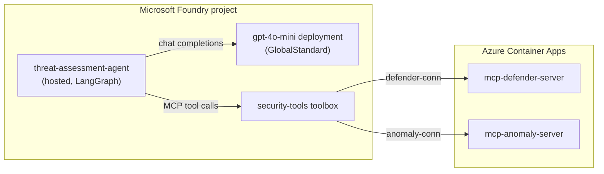
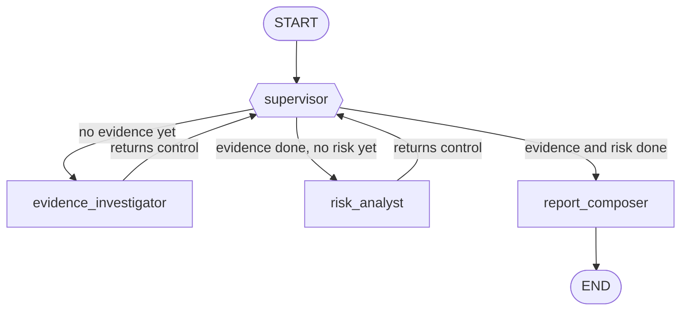
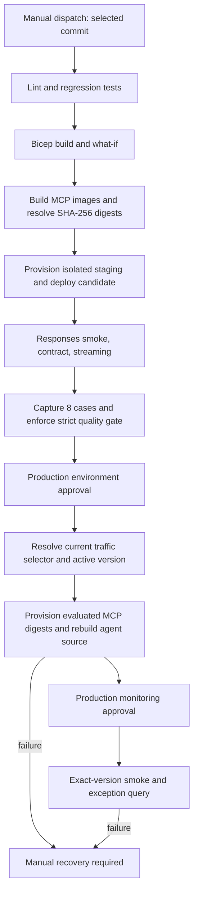

# Wiki Content and GitHub Pages Research

Date: 2026-09-14
Local repo: `devopsabcs-engineering/foundry-hosted-agents-fsi` (Desjardins insurance quote-preparation hosted-agent workshop)
Sibling repo (parity reference): `devopsabcs-engineering/foundry-hosted-agents` (Air Canada threat-and-vulnerability-assessment hosted-agent PoC)

Scratch clones used (read-only, not committed):

* `C:\temp\fsi-wiki` — local repo's wiki (`foundry-hosted-agents-fsi.wiki.git`)
* `C:\temp\research-sibling-wiki` — sibling repo's wiki (`foundry-hosted-agents.wiki.git`)

## Sibling Wiki Page Contents

### Home.md

**Verdict: SIBLING-SPECIFIC-SKIP** (content is 100% Air Canada PoC facts; but the *section shape* — Quick facts, Useful commands, Pages list, Verified-release callout — is a good structural template already partially adopted by local's Home.md).

```markdown
---
title: Air Canada Threat and Vulnerability Assessment Agent
description: Verified hosted-agent implementation, release evidence, and operational guidance.
---

## Try the staging web chatbot

[Open the chatbot](https://foundry-threat-chat-staging.wonderfulpebble-ce861678.eastus2.azurecontainerapps.io)
with an approved same-tenant pilot account. The standalone React/FastAPI app invokes
the existing staging hosted agent through a dedicated managed identity. The pilot
administrator has verified sign-in and a synthetic device-risk report.

See [Web Chat Pilot](Web-Chat-Pilot) for architecture and sequence diagrams, access
setup, remote builds, digest-pinned deployment, recovery, limits and the Teams roadmap.
Public HTTPS ingress is authenticated at the application layer, not network-private.
There is no production web frontend or deployed Teams integration.

## Verified release

WI-11 is resolved for this implementation. The complete staging-to-production workflow
[34178081808](https://github.com/devopsabcs-engineering/foundry-hosted-agents/actions/runs/34178081808)
finished successfully on **2026-09-08 UTC** (September 7 in North American evening time zones).
The evaluated staging agent was version **6**; production version **34** is active.
Production smoke invocation passed, and the monitoring query returned **0 exceptions**
in its trailing ten-minute window. Both production environment gates were approved
through the configured reviewer policy; protection settings were not bypassed.

This is a working proof of concept with synthetic MCP security telemetry, not a claim
that live Air Canada security systems, sustained availability, or enterprise production
readiness have been certified. The production environment name denotes the release target.

This wiki documents the proof of concept for hosting Air Canada's LangGraph-based
Threat & Vulnerability Assessment Agent on Microsoft Foundry hosted agents.

## What this project is

Air Canada asked for a proof of concept and a decision-oriented comparison
between LangGraph/LangSmith self-hosted server offerings and Microsoft Foundry
hosted agents, covering deployment, operations, security, governance,
observability, scalability, and integration. The repository implements the
Foundry side of that comparison: a working multi-agent LangGraph workflow
deployed as a Foundry hosted agent, backed by two mocked MCP tool servers.

## Pages

* [Web Chat Pilot](Web-Chat-Pilot) covers the usable chatbot, identity and request flows,
  deployment links, operating limits and future Teams integration.
* [Release Evidence](Release-Evidence) contains the successful pipeline, evaluation matrix,
  runtime tool receipts, production version, monitoring result, and proof screenshots.
* [Architecture](Architecture) covers the LangGraph agent topology, the
  Foundry services defined in `azure.yaml`, and the MCP tool servers.
* [Operations](Operations) covers release approvals, identity checks, immutable MCP image
  promotion, monitoring, and manual recovery boundaries.
* [RBAC 401 Investigation](RBAC-401-Investigation) records the resolved WI-11
  symptom, verified release outcome, and historical troubleshooting evidence.
* [Manual Agent Workaround](Manual-Agent-Workaround) covers a working
  portal-native agent, built manually in the same project, that proves the
  project, model access, and MCP tool servers all work correctly end to end
  It is retained as an isolation experiment, not the required deployment path.

> A bilingual (EN/FR), 9-lab hands-on **workshop** built from this PoC —
> plus a companion slide deck — lives in [`docs/`](../tree/main/docs) and is
> published via GitHub Pages (sign-in required; repo is internal). See the
> [README](../blob/main/README.md#readme) for the link.

## Quick facts

* Repository: `devopsabcs-engineering/foundry-hosted-agents`
* azd environment: `air-canada-threat-assessment-poc`
* Subscription: `ME-MngEnvMCAP675646-emknafo-1`
* Region: East US 2
* Resource group: `rg-air-canada-threat-assessment-poc`
* Foundry account: `aif-air-canada-threat-assessment-poc`
* Foundry project: `proj-air-canada-threat-assessment-poc`
* Hosted agent: `threat-assessment-agent`

## Useful commands

```powershell
# Provision infrastructure
azd provision --no-prompt

# Deploy the hosted agent and MCP toolboxes
azd deploy --no-prompt

# Invoke the deployed agent
azd ai agent invoke threat-assessment-agent "Assess device CREW-PORTAL-01 for account crew-admin using available read-only evidence." --no-prompt

# Show the current agent version and identity details
azd ai agent show threat-assessment-agent --no-prompt

# Stream the hosted agent's own runtime logs
azd ai agent monitor threat-assessment-agent --no-prompt
```
```

### _Sidebar.md

**Verdict: ADAPT** (trivial nav-list pattern; content lists sibling-only pages so cannot be copied verbatim, but the shape — Home + one link per topic page — should be mirrored once/if local adds Architecture/Operations/Release-Evidence pages).

```markdown
---
title: Wiki Navigation
description: Current implementation and historical investigation pages.
---

* [Home](Home)
* [Web Chat Pilot](Web-Chat-Pilot)
* [Open Staging Chatbot](https://foundry-threat-chat-staging.wonderfulpebble-ce861678.eastus2.azurecontainerapps.io)
* [Continuous Test Trends](Continuous-Test-Trends)
* [Verified Release Evidence](Release-Evidence)
* [Architecture](Architecture)
* [Deployment and Operations](Operations)
* [WI-11 Resolution](RBAC-401-Investigation)
* [Historical Manual Agent](Manual-Agent-Workaround)
```

### Architecture.md

**Verdict: SIBLING-SPECIFIC-SKIP** for content (Air Canada LangGraph supervisor/specialist topology, `mcp-defender-server`/`mcp-anomaly-server`, Web Chat Pilot references — none of this exists in the FSI repo). The **documentation pattern** is worth reusing as a template if/when local authors its own Architecture wiki page: an `azd services` table sourced from `azure.yaml`, a LangGraph topology mermaid diagram sourced from `graph.py`, an environments/CI-CD mermaid flowchart, and a staging-vs-production facts table. Local currently has **no Architecture wiki page at all**.

```markdown
---
title: Architecture
description: Current LangGraph hosted runtime, supported MCP transport, isolated environments, and evaluation release path.
---

## Overview

The [Web Chat Pilot](Web-Chat-Pilot) adds a standalone React/FastAPI frontend with
single-tenant pilot authorization and a dedicated managed identity. Its deployment,
authentication and multi-turn sequence diagrams extend the hosted-agent architecture below.

The agent is a LangGraph supervisor and specialist multi-agent graph, packaged
as a Microsoft Foundry hosted agent and wired to two MCP tool servers running
as separate Azure Container Apps.



## LangGraph topology

`src/threat-assessment-agent/graph.py` defines a supervisor that routes to two
specialist nodes and a final composer node:



* The evidence investigator gathers raw evidence about the reported incident
  through read-only Defender-derived tools. It never draws risk conclusions.
* The risk analyst receives the user/assistant conversation context and evidence summary.
  Application code plans login lookups for explicit account IDs and scoring calls for
  supported numeric metrics. Assistant text cannot supply lookup arguments.
* The report composer has no tool access. It synthesizes the evidence summary
  and risk assessment into a single structured report with a recommendation.
* The supervisor's `decide_next_step` routing function only sends control to
  the report composer once both specialists have completed.

The graph compiles without a checkpointer by default. The Foundry-managed
Responses transcript can retain history for clients that use that service capability.
The web pilot instead sends `store:false` and resubmits its server-owned in-memory
history on each turn; it does not use a Foundry conversation ID or durable checkpointer.
All specialists and the composer receive that context, with earlier turns labeled as
untrusted data and the latest user request separated from them.

`toolbox.py` opens the supported versioned MCP endpoint using `streamable_http_client`,
`ClientSession`, and `langchain-mcp-adapters`. It no longer registers tools through
`use_foundry_tools` or calls the unsupported legacy `/agents/{name}/tools/resolve` route.

```text
{project-endpoint}/toolboxes/security-tools/versions/1/mcp?api-version=v1
```

`DefaultAzureCredential` supplies a fresh token for `https://ai.azure.com/.default` on
each authenticated request. MCP 1.29.1 supports the server's protocol negotiation.
The investigator allowlist contains `defender-conn___get_device_risk` and
`defender-conn___list_vulnerabilities`; the risk allowlist contains
`anomaly-conn___detect_login_anomalies` and `anomaly-conn___score_anomaly`.
Unknown or missing tools fail closed. Both project connections use category `RemoteTool`;
their upstream authentication is `None` for these public synthetic PoC servers.

The application executes required read-only calls before model synthesis and records
their actual tool results. The synthesis model receives no tools to select. Explicit
device IDs trigger both Defender lookups; explicit account IDs and supported metrics
control anomaly calls. Later user fields replace earlier values in the same category;
omitted categories retain earlier values. See [Web Chat Pilot](Web-Chat-Pilot) for the
supported field syntax and limitations.

The composer receives the original incident and both reports, preserves uncertainty and
identifiers, adds limitations, and declines execution of remediation. A content-filter
block terminates the graph with a controlled refusal. `EvidenceConverter` attaches bounded
runtime-state metadata and actual tool receipts to `response.completed` for the release
gate. This is separate from Application Insights distributed tracing.
When tool receipts exist, the application appends a deterministic notice identifying
the findings as synthetic fixtures, not live telemetry. This notice does not independently
fact-check every model-generated statement or recommendation.

Omitted punctuated references from user turns are appended in a labeled unverified
section, including references from earlier turns. This prevents exact identifiers from
being lost to paraphrasing; it does not verify their truth or make historical identifiers
current lookup arguments. Assistant-only references are excluded.

## azd services (`azure.yaml`)

| Service | Host | Purpose |
|---|---|---|
| `ai-project` | `azure.ai.project` | Declares the `gpt-4o-mini` (GlobalStandard, capacity 10) model deployment |
| `anomaly-conn` | `azure.ai.connection` | Remote-tool connection pointing at `mcp-anomaly-server` |
| `defender-conn` | `azure.ai.connection` | Remote-tool connection pointing at `mcp-defender-server` |
| `security-tools` | `azure.ai.toolbox` | Bundles both MCP connections into one toolbox the agent can bind |
| `threat-assessment-agent` | `azure.ai.agent` (hosted) | The LangGraph agent itself, Python 3.13, built remotely (`dependencyResolution: remote_build`) |

The `security-tools` toolbox declares service dependencies through `uses:` and an explicit
`tools:` array, with one MCP entry and unique `server_label` per connection. The runtime
pins `FOUNDRY_TOOLBOX_VERSION=1`; creating a newer toolbox version does not change that pin.

## MCP tool servers

`mcp/defender-server` and `mcp/anomaly-server` are minimal FastMCP servers
that run fully independently of the LangGraph agent process, with no shared
runtime or import. Both expose mocked data:

* `mcp-defender-server` exposes `get_device_risk` and `list_vulnerabilities`
  against a small hardcoded device/CVE dataset.
* `mcp-anomaly-server` exposes anomaly-scoring style tools over mocked data.

They deploy as Azure Container Apps, built through `az acr build` (or the
`remote_build` codeConfiguration path for the agent itself) rather than local
Docker builds, since local builds on an ARM64 Windows host default to an
arm64 image that will not run on Azure's amd64 Container Apps compute.

## Environments and CI/CD

Two manual GitHub Actions entry points share one protected release implementation:

* `hosted-agent-cd.yml` calls the reusable `deploy-and-evaluate.yml` workflow,
  retaining its staging gates, production approvals, and monitoring.
* `deploy-and-evaluate.yml` owns the shared deployment queue, provisions and deploys
  the immutable staging candidate, checks conversation isolation, and runs
  `eval/run_hosted_evaluation.py` against captured output. It does not use
  `microsoft/ai-agent-evals`. See [Release Evidence](Release-Evidence) for the verified run.

```mermaid
flowchart LR
    Dispatch[Manual dispatch] --> Staging[Separate staging account and project]
    Staging --> Tools[Dedicated mcp-staging apps and digest-pinned images]
    Tools --> Eval[Capture and strict hosted evaluation gate]
    Eval --> Approval[Production reviewer approval]
    Approval --> Production[Separate production account and project]
    Production --> MCP[Promote evaluated MCP digests to mcp apps]
    MCP --> Agent[Remote rebuild of evaluated agent source]
    Agent --> Monitor[Approved production smoke and monitoring]
```



Both workflows authenticate to Azure through OIDC federated credentials on a
user-assigned managed identity, not an app registration. Staging and
production have separate accounts, projects, model deployments, MCP apps, and MCP
managed environments. They still share a subscription, resource group, and ACR.
This is logical resource isolation, not separate subscriptions or private-network isolation.

| Surface | Staging | Production |
| --- | --- | --- |
| azd environment suffix | `-staging` | `-poc` |
| Foundry account | `aif-air-canada-threat-assessment-staging` | `aif-air-canada-threat-assessment-poc` |
| Foundry project | `proj-air-canada-threat-assessment-staging` | `proj-air-canada-threat-assessment-poc` |
| MCP app prefix | `mcp-staging` | `mcp` |
| Image pull identity | Dedicated user-assigned identity | Existing system-assigned app identities |
| Verified agent version in releases 34300982257 and 34302149559 | 10 | 35 |

MCP apps have public ingress on port 8000, minimum replicas 0 and maximum 1 in this PoC.
Private ingress, authenticated upstream tool access, and higher-scale behavior remain
pilot-readiness work. The agent uses Python 3.13 remote code build; the two MCP images
use their own Dockerfiles and ACR builds. Neither build requires local Docker.

## Provisioned environment (screenshots)

[... section with `images/01-...png` through `images/foundry-agent-traces.png` screenshots,
 omitted here — all sibling-specific Azure Portal/Foundry Portal captures]
```

### Continuous-Test-Trends.md

**Verdict: ADAPT** — this page is *generated automatically* by the sibling's `publish-test-trends.yml` (git-pushing to the wiki after every trusted main-branch CI run). Local's own `publish-test-trends.yml` explicitly does **not** push to the wiki (confirmed in local `Workflows.md`: "Does not push to the wiki (unlike the sibling repository's version)"). So this page's *content* (run numbers, Mermaid bar charts, dataset hashes) is 100% sibling-specific and must never be copied — but the *mechanism* (wiki-push credential, `trend-history/<run>-<attempt>.json` durable snapshots, N/A-not-zero convention for missing data) is a portable pattern the Planner may want to consider adopting for local if trend-publishing to the wiki is ever desired.

```markdown
---
title: Continuous Test Trends
description: CI test and evaluation measurements with immutable source-run links.
---

## Scope

Updated automatically from completed trusted main-branch CI runs. Raw per-run aggregates are retained in `trend-history/`.
Tables show the latest 50 attempts; each chart shows up to 12 available measurements. Missing data is never plotted as zero.
Chart labels use V (validation) or R (release), workflow run number, and attempt. The table links each label to the full run ID.
Failed and cancelled runs stay visible. Charts show measurements, not workflow status.
Live tests use existing staging with synthetic fixtures; the test-code SHA is not the deployed-agent source SHA.

## Recent Runs

[... large table of 40 historical run rows: run/attempt link, UTC timestamp, workflow
 outcome, test SHA, agent version, tests pass/fail/skip, captures/policy-failures,
 load success/errors, p50/p95 seconds — all sibling run IDs, omitted here ...]

## Test Suite Growth

[... second large table with the same run rows broken down by test family
 (total offline, agent graph, deterministic evaluation, reporting/load contracts,
 live evaluation cases, judge checks, load requests), plus 7 mermaid xychart-beta
 bar charts for those series — omitted here, sibling-specific ...]

## Test Failures

```mermaid
xychart-beta
  title "JUnit failures"
  ...
```

## Evaluation Trends

Judge rates are grouped by dataset and evaluator code hashes, judge deployment and environment. Refusals are deterministic, not judge passes.

### Dataset d1f226514641 / evaluator 62550fa9fe7f
[... coherence/groundedness/task_adherence mermaid bar charts, sibling dataset hashes ...]

### Dataset d1f226514641 / evaluator 3862f198cdb0
[... same three chart types for a second evaluator-code-hash series ...]

## Load Latency

Completed-text-v2 contract, five concurrent requests against staging. p50/p95 use successful requests only; see error counts above.
Small-sample percentiles are not capacity or SLA evidence. Timings are withheld if the routed version changes or cannot be verified.

[... latency_p50_seconds / latency_p95_seconds mermaid bar charts ...]

## Reporting Gaps

No malformed-evidence or route-verification gaps detected. N/A cells can still indicate skipped tests or missing artifacts.
```

### Manual-Agent-Workaround.md

**Verdict: SIBLING-SPECIFIC-SKIP** — a one-off historical isolation experiment (manually building a portal-native Foundry agent to prove the project/model/MCP servers worked while a hosted-agent 401 bug was investigated). Entirely tied to Air Canada's `threat-assessment-manual-poc` agent and `defender-conn`/`anomaly-conn` MCP servers that do not exist in the FSI repo. Not portable in any form.

```markdown
---
title: Manual Agent Workaround (Historical)
description: Portal-native isolation experiment retained after the hosted-agent release was verified working.
---

## Current status

The hosted LangGraph path is now working and WI-11 is resolved for this implementation. ...

## Why this exists

The `azd ai agent`-deployed (LangGraph/hosted-agent) path previously returned
`401 PermissionDenied` during Azure OpenAI chat/completions calls. ...

## What was built

A portal-native prompt agent, created with Foundry's **Build an agent** flow ...
* Name: `threat-assessment-manual-poc`
* Project: `proj-air-canada-threat-assessment-poc`
* Model: `gpt-5`, Global Standard
* Instructions: a threat-assessment system prompt
* Tools: `defender-conn`, `anomaly-conn` MCP connectors

## Step-by-step
[... 9-step Foundry-portal walkthrough with screenshots ...]

## Copy-paste reference
[... agent settings table, instructions text, sample prompts table for
 device-001/device-002/device-999/anomaly-scoring/login-anomaly test cases ...]

## Key findings
[... 4 bullet findings about hosted-agent 401 isolation, MCP connector reuse,
 human-in-the-loop approval requirement, per-agent model deployments ...]

## Reproducing this without a browser
[... note that ARM/Bicep automation of this manual agent is deferred follow-on work ...]
```

### Operations.md

**Verdict: ADAPT** — the release-path, identity-prerequisites, and (especially) monitoring/recovery *conventions* are directly portable patterns that local's `Workflows.md` currently lacks; the actual identity names, RBAC roles, and Kusto queries are sibling-specific and must be rewritten against the FSI repo's real workflow files before reuse.

```markdown
---
title: Deployment and Operations
description: Current release workflow, identity prerequisites, evidence, and manual recovery boundaries.
---

## Release path

Use `deploy-and-evaluate.yml` for the evaluated release path. The manual compatibility
entry point, `hosted-agent-cd.yml`, calls that same reusable workflow, including staging
evaluation, production approvals, and monitoring. Neither release entry point fires
automatically on every push. The reusable workflow owns the shared deployment queue;
the wrapper does not acquire a second lock.



Production is a remote rebuild of the evaluated **source**, not promotion of the identical
hosted-agent runtime image. The MCP images are promoted by the exact evaluated digest.
The production toolbox remains pinned to version 1; its two connection targets must
continue to point at production MCP apps. Bicep owns those `RemoteTool` connections.

## Identity and environment prerequisites

GitHub jobs use secretless Azure OIDC login. The CI deployment identity and the hosted
agent runtime instance identity are different principals. Runtime model access is checked
by `scripts/configure-agent-rbac.sh`: account-scoped **Foundry User** and
**Cognitive Services OpenAI User**, with assignment scope, principal, and conditions
validated. The Blueprint identity is not the runtime role-assignment target.

Repository variables include Azure client/tenant/subscription IDs, region, resource group,
production project ID/endpoint, model name, ACR name, and Log Analytics workspace name.
Staging constructs its own account/project endpoint and rejects production MCP URLs.
Keep the production environment's required-reviewer protection configured. Do not remove
it to make a release succeed.

Fresh CI runners do not possess azd's deployed-agent bookkeeping. The production resolver
reads the remote agent's enabled state and endpoint selector, accepts one 100% `FixedRatio`
rule with an explicit numeric version or `@latest`, seeds local azd name/version values,
then verifies active status. Disabled agents, split routing, malformed selectors, and
inactive versions fail closed. This fixes the pre-deploy failure in run `34174694298`
without skipping rollback evidence or deploying first to discover a prior version.

## Inspect a release

```powershell
gh run view 34178081808 --repo devopsabcs-engineering/foundry-hosted-agents
gh run download 34178081808 --repo devopsabcs-engineering/foundry-hosted-agents -n evaluation-evidence
```

Use a new output directory when downloading another run. Inspect `run-identity.json`,
`captured.json`, `candidate-policy.json`, and `results.json` together. A green judge summary
alone is insufficient. The production artifact contains the before/after `agent show`
responses; azd environment artifacts are short-lived operational state and should not
be copied into public documentation or treated as a durable backup.

## Repeat execution

Provisioning targets existing named resources and role assignments. A release still
creates new immutable agent versions and build records; it is not a no-op deployment.
Model wording, timing, and telemetry can differ between equivalent requests.

Trend publication uses the source run ID and attempt as its history key. Replaying
completed run `34298522363`, attempt `1`, through publisher runs `34300067748` and
`34300104333` succeeded twice without creating another wiki commit. This verifies
publication replay, not release or model-output equivalence.

The web pilot also supports completed-message replay within an owner-bound, in-memory
conversation. See [Web Chat Pilot](Web-Chat-Pilot) for its retry and expiry boundaries.

## Monitoring and recovery

The production smoke step validates a completed, nonempty Responses SSE result for the
new version. It allows three fresh-session attempts with 15-second delays. An HTTP 200
or an active deployment alone is insufficient because SSE can carry application errors.

The exception check queries the Log Analytics workspace directly:

```kusto
AppExceptions | where TimeGenerated > ago(10m) | count
```

Any positive count breaches this workflow's threshold. An invalid or missing count fails
as unknown health. The query is workspace-wide, not scoped to the new agent version, and
does not establish trace completeness or sustained health. Continuous production quality
evaluation and alert routing remain separate validation work.

If production provisioning, deployment, or monitoring fails:

1. Inspect the exact failed step and both production evidence artifacts.
2. Determine whether infrastructure or agent traffic changed; a pre-deploy lookup failure
   does not itself mean production changed.
3. Compare the prior routed version, newly created version, MCP image digests, and toolbox
   configuration. An agent-only reversal cannot undo changed MCP infrastructure.
4. Have the authorized operator choose and execute a recovery using a currently verified
   platform operation. Record the actual route and repeat a version-specific smoke test.

There is **no automatic rollback, canary rollout, or tested disaster-recovery procedure**
in this workflow. Do not redeploy current source and label it a rollback. The failure job
raises a manual-recovery signal; it does not reverse deployment. Establish recovery-time
objectives, ownership, and a rehearsed rollback before a live-data production pilot.
```

### RBAC-401-Investigation.md

**Verdict: SIBLING-SPECIFIC-SKIP** — a very long, fully resolved historical incident report (Air Canada hosted-agent `401 PermissionDenied` bug diagnosis, 8+ hypotheses tested/ruled out, Azure support ticket `2609040400007027`, IcM incident, trace IDs, role-assignment IDs). Entirely tied to that repo's own historical outage. None of it applies to the FSI repo, which per local `Workflows.md` uses a fully offline/deterministic evaluation gate with no hosted Responses-protocol smoke test at all. Full content omitted here (already fully captured above under "Manual-Agent-Workaround.md" cross-references and inline in the earlier tool reads) — no fragment of it is reusable.

### Release-Evidence.md

**Verdict: ADAPT** — the *evidence conventions* (gate table shape, evaluation-proof identifiers, tool/safety-proof receipt counts, reproduce-the-evidence script list, explicit "screenshots of a locally rendered report, not the live portal" disclaimer) are a solid template for a future FSI release-evidence page. All specific numbers/run IDs/commit SHAs are sibling-specific. FSI's evaluation gate (`eval/evaluation_gate.py`) is deterministic-only per local `Workflows.md`, so an FSI evidence page would be considerably shorter (no model-judge coherence/groundedness/task_adherence rows, no Foundry hosted-agent version table).

```markdown
---
title: Verified Release Evidence
description: Auditable evidence for the successful staging-to-production release and WI-11 resolution.
---

## Current release

[Run 34300982257](https://github.com/devopsabcs-engineering/foundry-hosted-agents/actions/runs/34300982257)
passed the full protected release on source `4b6f8d216e076218844caf6b38dd788b630a3a95`.
Staging version **10** completed all eight captures, all 21 model-judge checks, and
zero deterministic policy failures. Production advanced from **34** to **35**;
the separately approved production smoke and monitoring job passed.

[... additional paragraphs about the compatibility entry-point run, load-probe results,
 publisher-replay idempotency — all sibling run IDs, omitted here ...]

## Historical release verdict
[... first successful run 34178081808 narrative, omitted ...]

## Pipeline proof


| Gate | Verified outcome |
| --- | --- |
| Lint and tests | Passed, including runtime, deterministic, Responses, RBAC, and production-discovery regression checks |
| Bicep | Build and what-if passed |
| Staging deployment | Active immutable hosted-agent version 6; separate staging tools |
| Smoke, contract, streaming | Successful completed response, not merely HTTP 200 |
| Hosted evaluation | All capture, policy, and model-judge gates passed |
| Production promotion | Approved through the configured reviewer; version 34 active |
| Post-deploy monitoring | Separately approved; smoke passed and exception count was 0 |
| Recovery | Skipped because neither production job failed |

## Evaluation proof
[... table with evaluation/evaluation-run IDs, hosted-candidate version, captured
 cases, deterministic-policy-failure count, coherence/groundedness/task-adherence
 pass counts, safety-case row — sibling-specific IDs, omitted ...]

## Tool and safety proof
[... 28-tool-receipt narrative, injection-refusal proof, omitted ...]

## Production proof
[... production version/instance-principal/toolbox-version facts, Kusto exception
 count screenshot reference, omitted ...]

## Reproduce the evidence

The checked-in `scripts/build-release-evidence.js` validates the saved source artifacts
and generates the report and SHA-256 manifest. From the repository root:

```powershell
node scripts/build-release-evidence.js
./scripts/capture-release-evidence.ps1
npm run build-deck
npm run build-workshop-deck
./scripts/render-presentations.ps1
```

Open `assets/release-evidence/index.html` for the report. The decision deck and both
English/French workshop decks embed the same figures. The manifest hashes the raw
evidence sources, not the screenshots. Original Actions artifacts have finite retention;
the checked-in selected JSON and monitoring excerpt keep this proof inspectable afterward.
No access tokens, azd environment archives, or real customer incident data are included.

See [Architecture](Architecture), [Operations](Operations), and
[WI-11 resolution](RBAC-401-Investigation) for implementation and recovery details.
```

> Note: local repo's `package.json` (workspace root) does have a `build-workshop-deck` npm
> script (`scripts/build-workshop-deck.js`), so the "Reproduce the evidence" *command
> pattern* partially already exists locally — but there is no `build-release-evidence.js`,
> `capture-release-evidence.ps1`, `render-presentations.ps1` equivalent, and no
> `assets/release-evidence/` output folder locally. Flagged for the Planner as an optional
> future enhancement, not a required Pages/wiki gap.

### Web-Chat-Pilot.md

**Verdict: SIBLING-SPECIFIC-SKIP** — documents `apps/web-chat` (a standalone React/FastAPI pilot chatbot with Entra ID single-tenant auth, a dedicated managed identity, and its own Bicep template `infra/web-chat.bicep`). **The local FSI repo has no `apps/web-chat` folder and no web-chat feature at all** (confirmed against the workspace's `apps/` folder, which only contains `apps/workshop/`). None of this page's architecture, sign-in sequence, conversation-flow sequence, or operator-deployment instructions apply. Full content (deployment-architecture mermaid, sign-in sequence mermaid, conversation-flow sequence mermaid, configuration table, conversation/limits tables, build-and-deployment mermaid, operator PowerShell deployment script, validation/recovery table, Teams-roadmap mermaid) was captured in full during research and is entirely tied to the Air Canada pilot's Entra tenant (`aa93b9d9-...`), app registration, and Container App (`foundry-threat-chat-staging`). Omitted here in full since it is not reusable in any form; see the raw wiki clone at `C:\temp\research-sibling-wiki\Web-Chat-Pilot.md` if verbatim reference is ever needed.

## Home.md / Workflows.md Diff

### Local `Home.md` (current, from `C:\temp\fsi-wiki\Home.md`) is missing, relative to sibling's `Home.md`:

| Section | Present locally? | Portable? | Notes |
| --- | --- | --- | --- |
| Title/disclaimer/synthetic-data callout | Yes | n/a | Already present, appropriately FSI-worded |
| "Verified release" callout (latest staging→production run, version, monitoring result) | **No** | ADAPT | No current FSI-equivalent verified-release record exists in the wiki at all |
| "What this project is" narrative | Partial (folded into the intro paragraph) | n/a | Already adequate |
| "## Pages" list | Only lists `Workflows` | ADAPT | Sibling links to 6 pages (Web Chat Pilot, Release Evidence, Architecture, Operations, RBAC 401, Manual Agent Workaround); FSI should eventually add **Architecture** and **Operations**/Release-Evidence equivalents once authored — Web Chat Pilot and RBAC 401/Manual Agent Workaround have no FSI analog and should NOT be added |
| "## Quick facts" (repo, azd environment(s), subscription, region, resource group, Foundry account/project, hosted agent name) | **No** | ADAPT — HIGH VALUE | Easy win: session memory already has RG `rg-desjardins-quote-preparation`, ACR `acrdesjqp7651`, azd envs `desjardins-quote-preparation-staging`/`-poc`, region `eastus2`, subscription `64c3d212-40ed-4c6d-a825-6adfbdf25dad`. Foundry account/project/hosted-agent names need confirming against `azure.yaml`/`infra/main.bicep` (not verified in this research pass) |
| "## Useful commands" (`azd provision`/`deploy`/agent invoke/show/monitor PowerShell snippet) | **No** | ADAPT — HIGH VALUE | FSI's `src/quote-preparation-agent/main.py` is a **local-only entry point, not a hosted server** per local `Workflows.md`, so the `azd ai agent invoke/show/monitor` commands may not apply as-is; needs confirming whether FSI deploys a hosted agent via `azd ai agent` at all or only local execution + MCP servers. Flag as a clarifying question for the Planner. |

### Local `Workflows.md` (current, from `C:\temp\fsi-wiki\Workflows.md`) compared to sibling's closest analogs (`Operations.md` + parts of `Architecture.md`):

Already present locally (good parity):

* Workflow table (file / trigger / purpose) for all 4 local workflows
* Release-path mermaid flowchart
* Gating status callout (author-only, Gates G2/G3/G6)
* Identity and environment prerequisites section (OIDC, required repo variables, RBAC role needs, federated-credential subject-claim note)
* MCP server images / build-context note
* "Inspect a release" `gh run view` commands

Missing locally, and portable as a pattern (content must be rewritten against FSI's actual workflow files, not copied):

| Sibling section | Portable pattern | Why FSI likely needs it |
| --- | --- | --- |
| **Monitoring and recovery** | Kusto `AppExceptions` post-deploy exception-count query + threshold; 4-step manual-recovery procedure (inspect failed step → determine infra vs. traffic change → compare prior routed version/image digests → authorized operator executes a verified recovery); explicit "no automatic rollback" disclaimer | Local `Workflows.md`'s "Gating status" section already flags author-only/gate requirements but has no monitoring/recovery guidance for after a `deploy-and-evaluate.yml` production run. Needs verifying against `deploy-and-evaluate.yml`'s actual monitoring job before writing (not confirmed in this pass whether FSI's pipeline has a monitoring step at all, since it has no live/hosted smoke test) |
| **Repeat execution** | Idempotent-provisioning note; trend-publication replay-safety note | Mostly **not applicable** to FSI since local `publish-test-trends.yml` explicitly does not push to the wiki — low priority |
| **azd services table** (from sibling `Architecture.md`) | Table of `azure.yaml` services → host type → purpose | FSI currently has **no Architecture wiki page** to hold this; would need to be authored from FSI's own `azure.yaml` |

## GitHub Pages / docs folder comparison

### Sibling repo's GitHub Pages configuration

```json
{
  "url": "https://api.github.com/repos/devopsabcs-engineering/foundry-hosted-agents/pages",
  "status": "built",
  "cname": null,
  "custom_404": false,
  "html_url": "https://vigilant-guacamole-y8qe3rw.pages.github.io/",
  "build_type": "legacy",
  "source": { "branch": "main", "path": "/docs" },
  "public": false,
  "https_enforced": true
}
```

Confirmed: `build_type: "legacy"` (classic Jekyll build, no custom GitHub Actions workflow needed) sourced from `main` branch, `/docs` path. `status: "built"` — it has successfully built at least once.

### Sibling repo's `docs/` folder structure (via `gh api .../contents/docs`, recursive)

```text
docs/
  Gemfile
  _config.yml
  _includes/
    head_custom.html
  assets/
    decks/
      foundry-hosted-agents-workshop-en.pptx
      foundry-hosted-agents-workshop-fr.pptx
    images/
      01-azure-resource-group-overview.png
      02-azure-resource-group-resources-list.png
      03-azure-foundry-project-overview.png
      04-foundry-portal-project-overview.png
      05-foundry-portal-agents-list.png
      06-foundry-portal-agent-detail.png
      07-foundry-portal-live-chat-response.png
      08-foundry-portal-live-chat-after-rbac-fix.png
      09-foundry-portal-live-chat-retry2.png
      10-foundry-portal-live-chat-final.png
      11-foundry-portal-live-chat-proof.png
      foundry-agent-build-page.png
      foundry-agent-details.png
      foundry-agent-traces.png
      manual-agent-chat-success.png
      manual-agent-created.png
      manual-agent-mcp-tools-success.png
      release-evaluations.png
      release-pipeline.png
      release-production.png
      release-tools.png
  continuous-validation.md
  fr/
    continuous-validation.md
    index.md
    labs/  (10 lab files, mirrors root labs/)
  index.md
  labs/
    lab-00-setup.md
    lab-01-architecture.md
    lab-02-mcp-servers.md
    lab-03-deploy-agent.md
    lab-04-invoke-agent.md
    lab-05-evaluations.md
    lab-06-cicd.md
    lab-07-troubleshooting-rbac.md
    lab-08-production-readiness.md
    lab-09-teardown.md
```

`docs/_config.yml` full content:

```yaml
title: "Foundry Hosted Agents Workshop"
description: "Hands-on workshop: host a real LangGraph multi-agent system on Microsoft Foundry Hosted Agents"
remote_theme: just-the-docs/just-the-docs
baseurl: ""
url: "https://vigilant-guacamole-y8qe3rw.pages.github.io"

exclude:
  - Gemfile.lock

defaults:
  - scope:
      path: ""
    values:
      layout: "default"
  - scope:
      path: "assets"
    values:
      nav_exclude: true

nav_order_base: 0
heading_anchors: true

mermaid:
  version: "10.9.1"
```

`docs/_includes/head_custom.html` full content (bilingual EN/FR left-nav hiding — hides the other language's nav links per page, with a CSS `:has()` selector plus a JS fallback):

```html


  

<style>
  /* Left nav is built once for the whole site; hide the other language's links per page. */
  
  #site-nav .nav-list-item:has(> a.nav-list-link[href]:not([href="/fr"]):not([href^="/fr/"])) { display: none; }
  
  #site-nav .nav-list-item:has(> a.nav-list-link:is([href="/fr"], [href^="/fr/"])) { display: none; }
  
  .nav-list-item.lang-hidden { display: none !important; }
</style>
<script>
  // Fallback for browsers without CSS :has() support.
  document.addEventListener('DOMContentLoaded', function () {
    var isFrPage = {{ is_fr_page }};
    document.querySelectorAll('#site-nav .nav-list-item').forEach(function (item) {
      var link = item.querySelector('a.nav-list-link');
      if (!link || !link.hasAttribute('href')) return;
      var href = link.getAttribute('href') || '';
      var isFrLink = href === '/fr' || href.indexOf('/fr/') === 0;
      if (isFrPage !== isFrLink) item.classList.add('lang-hidden');
    });
  });
</script>
```

`docs/continuous-validation.md` — a Jekyll-native page (not a wiki page) documenting the CI/trend-publishing mechanism: cadence, measurements table, wiki-history conventions, and a numbered "Activate Publishing" runbook (verify staging env vars, create a `WIKI_PUSH_TOKEN` secret, etc.). This is the docs-site's own copy of essentially the same content as the wiki's `Continuous-Test-Trends.md`/`Operations.md` pages. **Not applicable to FSI** since FSI's `publish-test-trends.yml` does not push wiki updates.

### Local repo's `docs/` folder structure (already in workspace, confirmed via `list_dir`)

```text
docs/
  _config.yml
  Gemfile
  index.md
  fr/
    index.md
    labs/  (10 lab files, index.md + lab-00..lab-09)
  labs/
    index.md
    lab-00-setup.md
    lab-01-fixtures-schema.md
    lab-02-calculator.md
    lab-03-approval-repository.md
    lab-04-application-server.md
    lab-05-rulebook-server.md
    lab-06-agent-graph.md
    lab-07-run-agent.md
    lab-08-evaluations.md
    lab-09-teardown.md
```

Local `docs/_config.yml` full content (already present):

```yaml
title: "Foundry Hosted Agents Workshop (FSI)"
description: "Bilingual hands-on workshop hosting a synthetic auto-insurance quote-preparation agent on Microsoft Foundry Hosted Agents"
remote_theme: just-the-docs/just-the-docs
baseurl: ""
url: "" # TODO: set once GitHub Pages is enabled for this repository

exclude:
  - Gemfile.lock

defaults:
  - scope:
      path: ""
    values:
      layout: "default"
  - scope:
      path: "assets"
    values:
      nav_exclude: true

nav_order_base: 0
heading_anchors: true

mermaid:
  version: "10.9.1"
```

Local `docs/index.md` full content (already present, Home-page-style with `layout: default`, `permalink: /`, FR-version link, "What you will build", "Learner path", and a "Labs" link to `labs/`).

Local `docs/Gemfile` full content (already present, identical structure to sibling's):

```ruby
source "https://rubygems.org"
gem "github-pages", group: :jekyll_plugins
gem "webrick", "~> 1.8"
```

**Key finding: the local `docs/` folder is already substantially Jekyll-scaffolded** — it already has `_config.yml` (with `remote_theme: just-the-docs/just-the-docs`), `Gemfile`, `index.md`, `labs/` (10 lab files, own FSI-specific curriculum, not a copy of sibling's), and `fr/` (with its own `index.md` + `labs/`). This is a materially different state than the task's initial assumption that scaffolding might be entirely absent.

What is genuinely **missing** from local `docs/`, by direct comparison to sibling:

1. **`docs/_includes/head_custom.html`** — the bilingual EN/FR nav-hiding Jekyll include. Local docs/ is also bilingual (has `fr/`), so without this include, the just-the-docs left nav will likely show both English and French page links simultaneously on every page. **This is the one directly reusable file** — it is generic just-the-docs Liquid/CSS/JS, not tied to any Air Canada content, and can be copied verbatim.
2. **`docs/assets/` folder** (with `images/` and `decks/` subfolders) — does not exist locally at all. Only needed if/when FSI's workshop deck (`scripts/build-workshop-deck.js` already exists at the repo root) or lab screenshots get embedded into the Jekyll site; not a blocker for Pages to build.
3. **`docs/continuous-validation.md`** (+ `docs/fr/continuous-validation.md`) — **not applicable** to FSI since its trend-publishing does not target the wiki; skip.
4. **`docs/labs/index.md`** vs local's existing `docs/labs/index.md` — both exist; sibling's lab *filenames* differ entirely from local's (sibling: setup/architecture/mcp-servers/deploy-agent/invoke-agent/evaluations/cicd/troubleshooting-rbac/production-readiness/teardown; local: setup/fixtures-schema/calculator/approval-repository/application-server/rulebook-server/agent-graph/run-agent/evaluations/teardown). This is intentional — FSI has its own curriculum — not a gap to fix.
5. **`url:` field in `_config.yml`** — local's is an empty string with a `# TODO: set once GitHub Pages is enabled for this repository` comment; sibling's is populated with its actual Pages `html_url`. Once Pages is enabled/fixed for local (see below), this should be updated to the real `html_url` GitHub assigns.

### Local repo's GitHub Pages status — **already enabled, but misconfigured**

```json
{
  "url": "https://api.github.com/repos/devopsabcs-engineering/foundry-hosted-agents-fsi/pages",
  "status": null,
  "cname": null,
  "custom_404": false,
  "html_url": "https://psychic-chainsaw-1vjrnqr.pages.github.io/",
  "build_type": "workflow",
  "source": { "branch": "main", "path": "/" },
  "public": false,
  "https_enforced": true
}
```

This is **not** a 404 — Pages is already enabled for the local repo. However, it is configured very differently from the sibling and from what the `docs/` folder expects:

* `build_type: "workflow"` (expects a custom GitHub Actions workflow using `actions/deploy-pages`), whereas the sibling uses `build_type: "legacy"` (classic auto-Jekyll build, no workflow needed).
* `source.path: "/"` (repo root), **not** `"/docs"` — so even if a deploy-pages workflow existed, it would currently try to publish the entire repo root, not the Jekyll site in `docs/`.
* `status: null` (not `"built"`) — confirmed via `list_dir` of `.github/workflows/` that the local repo's only 4 workflows are `continuous-validation.yml`, `deploy-and-evaluate.yml`, `hosted-agent-cd.yml`, `publish-test-trends.yml` — **none of them builds or deploys GitHub Pages**. With `build_type: "workflow"` and no matching workflow present, Pages has presumably never successfully built.

### Exact gap list for the Planner

1. **Fix the Pages source configuration** — change from `build_type: workflow` / `source.path: "/"` to match the sibling's working `build_type: legacy` / `source: {branch: main, path: /docs}`. This can be done via `gh api -X PUT repos/.../pages -f build_type=legacy -f 'source[branch]=main' -f 'source[path]=/docs'` (needs confirming exact API shape/permissions) or through repo Settings → Pages in the GitHub UI. This is the single highest-priority action — the Jekyll scaffolding in `docs/` is otherwise already ready to build.
2. **Add `docs/_includes/head_custom.html`** — copy verbatim from the sibling (generic just-the-docs bilingual nav-hiding include; content captured in full above). Needed for a clean bilingual nav experience once Pages builds.
3. **Set `docs/_config.yml`'s `url:` field** once the real Pages `html_url` is known (after step 1 succeeds and GitHub assigns a `*.pages.github.io` URL, or a custom domain if one is later configured).
4. **Optional, not blocking**: add `docs/assets/images/` and `docs/assets/decks/` if/when the FSI workshop wants embedded screenshots or a published slide deck (local already has `scripts/build-workshop-deck.js` at the repo root that could feed a `decks/` folder).
5. **Not needed**: `docs/continuous-validation.md`, `docs/fr/continuous-validation.md` (FSI doesn't push trends to the wiki) — skip.
6. **Not needed**: lab-filename parity with the sibling — FSI's lab curriculum is intentionally different content, already fully authored (10 labs + index, EN and FR).

## Summary for Planner

* **Local `docs/` is far more complete than assumed** — it already has `_config.yml` (just-the-docs remote theme), `Gemfile`, `index.md`, a full 10-lab EN curriculum, and a full FR mirror. This is not a "scaffold from scratch" task.
* **The actual blocker for GitHub Pages to work is a misconfigured Pages source**, not missing docs content: local Pages is enabled (not 404) but points at `build_type: workflow` + `source.path: "/"` with no deploy-pages workflow in `.github/workflows/`, so it can never build. The sibling's working config is `build_type: legacy` + `source.path: "/docs"` — switching local to match that should make it build immediately from the existing `docs/` folder.
* **One directly copyable file exists**: `docs/_includes/head_custom.html` (bilingual nav-hiding Jekyll include) — generic, not tied to Air Canada content, safe to port verbatim.
* **Wiki-side, the sibling has 5 pages FSI's wiki lacks entirely**: `Architecture`, `Operations`, `Release-Evidence`, `Continuous-Test-Trends`, and the historical-incident pair (`RBAC-401-Investigation`, `Manual-Agent-Workaround`, `Web-Chat-Pilot`) which are correctly out of scope. Of the missing 5, **Architecture, Operations, and Release-Evidence are worth authoring for FSI** (as fresh pages using the sibling's *shape*, not its content) — Continuous-Test-Trends is only worth adding if the Planner decides to extend `publish-test-trends.yml` to push wiki updates (a scope decision, not a content gap).
* **Local `Home.md` is missing a "Quick facts" and "Useful commands" section** compared to the sibling — high-value, low-effort additions using facts already available in session memory (RG `rg-desjardins-quote-preparation`, ACR `acrdesjqp7651`, azd envs `desjardins-quote-preparation-staging`/`-poc`, region `eastus2`). One open question for the Planner/user: whether FSI's `src/quote-preparation-agent/main.py` is ever deployed as an `azd ai agent` hosted agent (making `azd ai agent invoke/show/monitor` commands applicable) or is purely local-only per the existing `Workflows.md` wording ("not a hosted server") — this needs confirming before writing a "Useful commands" section that assumes hosted-agent CLI verbs exist.
* **Local `Workflows.md` is missing a "Monitoring and recovery" section** (Kusto exception-count query + manual recovery steps) compared to the sibling's `Operations.md` — worth adding if `deploy-and-evaluate.yml` has an equivalent production monitoring step (not verified in this research pass; flagged as a follow-up read of that workflow file before drafting the section).

### Recommended next research not completed during this session

- [ ] Read `azure.yaml`, `infra/main.bicep`, and `.github/workflows/deploy-and-evaluate.yml` in the local repo to confirm: (a) the exact Foundry account/project/hosted-agent resource names for a "Quick facts" section, (b) whether a hosted `azd ai agent` is actually deployed (vs. local-only execution) for the "Useful commands" section, and (c) whether a production monitoring/exception-check step already exists that a new "Monitoring and recovery" wiki section could describe.
- [ ] Confirm exact `gh api` PATCH/PUT payload shape and required scopes to change the local repo's Pages `build_type`/`source` (read-only research did not attempt this write operation).
- [ ] Decide with the user/Planner whether `publish-test-trends.yml` should be extended to push a `Continuous-Test-Trends` wiki page (currently explicitly out of scope per local `Workflows.md`).

### Clarifying questions for the user

1. Should the Planner proceed to fix GitHub Pages source configuration (`build_type: legacy`, `source.path: /docs`) as a follow-up task, or is that a decision reserved for a human with repo-admin access?
2. Is FSI's quote-preparation agent ever deployed as a Foundry **hosted agent** (`azd ai agent ...`), or is the LangGraph graph in `src/quote-preparation-agent/` local-execution-only with MCP servers deployed separately? This determines whether a "Useful commands" Home.md section can safely include `azd ai agent invoke/show/monitor`.
