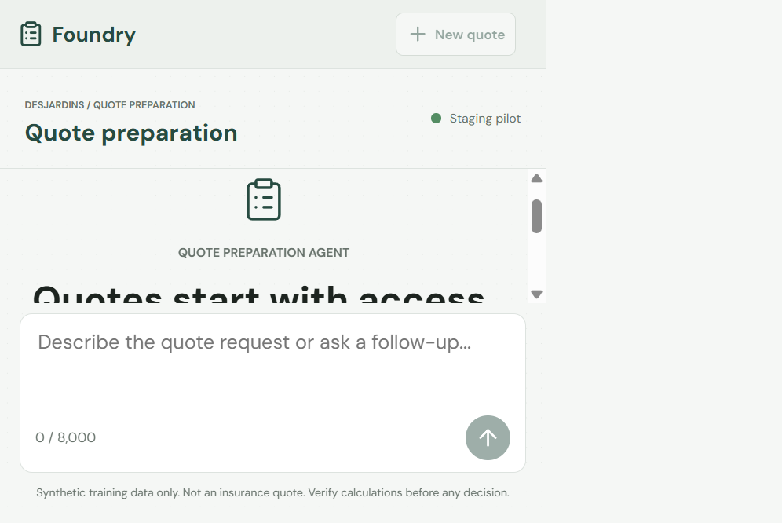

## Overview

This repository is a bilingual (English/French) hands-on workshop adapted
from the sibling
[`foundry-hosted-agents`](https://github.com/devopsabcs-engineering/foundry-hosted-agents)
repository. It replaces that repository's airline threat-assessment
scenario with a financial-services scenario: a synthetic Ontario
auto-insurance quote-preparation agent, backed by a deterministic
calculator and a mandatory, separately persisted employee-approval gate
before any applicant-facing preview.

> [!IMPORTANT]
> Every fixture, rulebook, and calculator output in this repository is
> synthetic and non-binding. Nothing here represents an actual Desjardins
> product, rate, or policy, and no regulator or insurer has reviewed or
> endorsed this workshop.

## Learner path

The default path through these labs does not require GitHub Copilot or any
other AI coding assistant. Where workshop authors used AI-assisted tooling
to help draft or review content, that assistance is disclosed in the
affected lab or file rather than implied as part of the learner
experience.

## Repository layout

* `docs/` holds the English workshop site (Jekyll, Just the Docs theme);
  start at [docs/index.md](docs/index.md).
* `docs/fr/` holds the French workshop site, structurally paired with
  `docs/`; start at [docs/fr/index.md](docs/fr/index.md).
* `src/quote-preparation-agent/` will hold the hosted LangGraph
  quote-preparation agent.
* `mcp/application-server/` will hold a read-only MCP service exposing
  synthetic application data.
* `mcp/rulebook-server/` will hold a read-only MCP service exposing
  synthetic rulebook data.
* `apps/workshop/` will hold the deterministic calculator, approval
  repository, and applicant/reviewer views.
* `apps/web-chat/` holds an internal-pilot web chatbot for the hosted
  agent, ported from the sibling repository. It is code-complete but
  gated behind the G2/G3/G6 sign-off described in
  [infra/README.md](infra/README.md) -- see
  [Deployment links](#deployment-links) below.
* `data/synthetic/` will hold the synthetic fixtures and JSON Schema for
  the quote-preparation contract.
* `eval/` will hold the evaluation harness for arithmetic, approval,
  injection, and bilingual-parity checks.
* `infra/` will hold Bicep infrastructure modules, author-only until
  platform and regulatory review gates clear.
* `scripts/` will hold shared helpers, including the bilingual
  workshop-deck generator.

## Getting started

Start at the workshop landing page: [docs/index.md](docs/index.md) in
English, or [docs/fr/index.md](docs/fr/index.md) in French. The same
content is published as a browsable site at
<https://devopsabcs-engineering.github.io/foundry-hosted-agents-fsi/>
(GitHub sign-in is required while this repository is private).

## Try the web chatbot

The chat UI in `apps/web-chat/` is not hosted anywhere yet (see the gate
note under [Deployment links](#deployment-links)), so the supported way to
see and use it today is to run it locally against the real deployed agent:

```powershell
cd apps/web-chat/frontend
npm install
npm run build
cd ..
$env:AGENT_ENDPOINT = "$env:FOUNDRY_PROJECT_ENDPOINT/agents/quote-preparation-agent/endpoint/protocols/openai/responses?api-version=v1"
$env:ENTRA_TENANT_ID = (az account show --query tenantId -o tsv)
$env:ENTRA_CLIENT_ID = "<app registration id from scripts/setup-web-chat-identity.ps1>"
$env:PILOT_GROUP_ID = "<pilot security group object id>"
python -m uvicorn app:create_app --factory --host 127.0.0.1 --port 8000
```

Then open <http://127.0.0.1:8000/>. The landing screen renders without any
Entra configuration; **Sign in with Microsoft** and the message composer
only become usable once `ENTRA_CLIENT_ID` and `PILOT_GROUP_ID` point at a
real app registration and pilot group.



If `npm install` fails with `EALLOWREMOTE`, the npm 12 default
`allow-remote = "none"` is rejecting the corporate feed proxy's absolute
tarball URLs; re-run it as `npm install --allow-remote=all`.

## Deployment links

This repository does not hardcode a "live demo" URL here, because the
underlying Container Apps hostnames and Foundry project name are
environment-specific and can be re-provisioned. Instead, the
[wiki Home page](https://github.com/devopsabcs-engineering/foundry-hosted-agents-fsi/wiki/Home)
carries an always-current **Deployment Links** table -- refreshed
automatically after every staging or production run of
[`Deploy and Evaluate (Staging -> Production)`](https://github.com/devopsabcs-engineering/foundry-hosted-agents-fsi/actions/workflows/deploy-and-evaluate.yml)
-- with clickable links to whatever is genuinely deployed right now:

* the hosted agent's Foundry project (Azure Portal, sign-in required)
* the agent's Responses API endpoint
* the `application-server` and `rulebook-server` MCP endpoints
* the resource group and container registry
* the published workshop site on GitHub Pages

See also the
[Continuous Test Trends](https://github.com/devopsabcs-engineering/foundry-hosted-agents-fsi/wiki/Continuous-Test-Trends)
wiki page for the latest offline-test, deterministic-gate, and LLM-judge
evaluation results.

**Web chatbot pilot**: `apps/web-chat/` (a browser-based chat UI in front
of the hosted agent) is deployed out of band rather than by
`deploy-and-evaluate.yml`. Its template is
[infra/web-chat.bicep](infra/web-chat.bicep), applied with a direct
`az deployment group create` into the Container Apps environment that
`infra/main.bicep` already provisioned, and its Entra app registration comes
from [scripts/setup-web-chat-identity.ps1](scripts/setup-web-chat-identity.ps1).
Because the managed environment is recreated whenever its network
configuration changes, redeploy the chat and rerun the identity script after
any network rebuild.